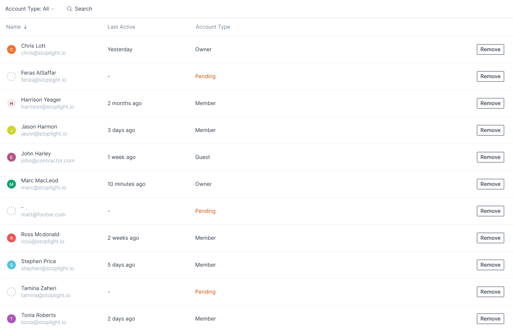
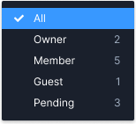

# Stoplight Coding Challenge - User List Component

Create an user list component component that supports sorting and filtering.

## Instructions

1. Create a new private Github repository called "Stoplight Coding Challenge".
2. Clone this repository and push the code to your new repository.
   - `git clone https://github.com/stoplightio/fe-coding-challenge`
   - `git remote set-url origin https://github.com/YOUR_USERNAME/YOUR_REPOSITORY`
   - `git push`
3. In GitHub, go to Settings > Manage access > Invite a collaborator and invite me: [https://github.com/wmhilton](https://github.com/wmhilton)
4. Run `yarn` to install all the dependencies.
5. Run `yarn start` to start the dev server.
6. Start editing `src/components/App`.

## Task

Create a UserList component from a design.

The component should match the provided Figma design as closely as possible: https://www.figma.com/proto/oTzalUuDYt5KgDjYAvma2h/Hiring---Frontend---Members-List?node-id=1%3A563&viewport=594%2C489%2C0.4336075186729431&scaling=min-zoom

The design is an interactive prototype, so do check out the link. A static screenshot is provided below just in case:

Since this is a frontend challenge, all the data sorting / filtering / pagination should be implemented in client JavaScript, even though you (hopefully) appreciate that in real-world applications with lots of users, filtering and sorting would need to happen on the server due to pagination concerns.

## Implementation Requirements
- [ ] Please write your components using TypeScript
- [ ] Demonstrate using React Functional components and React Hooks (We use functional components and hooks _extensively_ at Stoplight, and have ditched the class-based components for the most part)
- [ ] Please style your components using Sass or some CSS-in-JS library you like.

## Functional Requirements

- [ ] The component should fetch the data from `/api/users`
- [ ] The component should list users in alphabetical order by first name by default
- [ ] Clicking on a column header should sort the table by that column descending and display a down arrow next to the header.
- [ ] Clicking a column that is already sorted should toggle whether the sort order is ascending or descending and show up or down arrows accordingly.
- [ ] The Search box at the top should allow typing search terms in it.
- [ ] If there are search terms in the Search box, only rows whose `name` or `email` includes the search terms should be shown.
- [ ] By default all account types are shown.
- [ ] Clicking the Account Type filter should display a select dropdown with each of the possible account types ("All", "Owner", "Member", "Guest", "Pending")
- [ ] The number of users of each type should be shown next to the name
  
- [ ] If the Account Type filter is set to a type other than "All", then only accounts with the matching type should be displayed.
- [ ] The Last Active column should display the time in a human-friendly format. (lastActive returned by API is a JS millisecond timestamp)
- [ ] If the "Remove" button is clicked, the row should be removed and not shown (until you refresh the page)

## Style Requirements

- [ ] Make it look pretty.
- [ ] Text should be centered vertically in table rows.
- [ ] Try to match the colors in the prototype.
    - normal text: #2D3748;
    - light gray text: #A0AEC0;
    - orange text: #D04D01;
    - column heading text: #718096;
- [ ] Try to match the font style in the prototype:
    - font-family: [Inter](https://fonts.google.com/specimen/Inter?preview.text=&preview.text_type=custom&query=Inter);
    - font-size: 12px;
    - font-style: normal;
    - font-weight: 400;
    - line-height: 16px;
- [ ] Use FontAwesome 5 (https://fontawesome.com) for icons.
- [ ] The user avatar circle things are colored randomly, there's no pattern to it.

## Project Structure

* `src/components`: we recommend making separate files / folders for each React component
* `src/components/App/App.tsx`: the top-level component
* `public`: static files
* `public/api/users`: the data source for the mock API (do not edit)

## Useful Links

* My email - [will.hilton@stoplight.io](mailto:will.hilton@stoplight.io)
* React Documentation - [https://reactjs.org/](https://reactjs.org/)
* create-react-app documentation - [https://create-react-app.dev/docs/getting-started](https://create-react-app.dev/docs/getting-started)
* Sass Documentation - [https://sass-lang.com/](https://sass-lang.com/)

